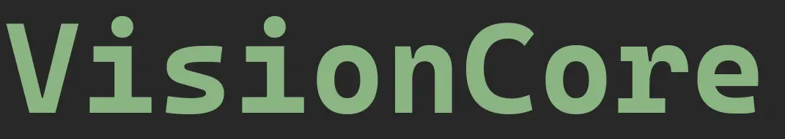

# VisionCore

<div align="center">
    </img><br/>
    
    </img>
    <a href="https://belier.iiens.net"></img></a>
    
    <p>
    Open real-time visual processing engine (filters, computer vision, AI)
    </p>
</div>

---

VisionCore is an **open, real-time visual processing engine** designed to process image and video streams through a modular pipeline of filters.

ASCII rendering is only one possible filter. The core goal of the project is to provide a **generic, extensible backend** for image processing, computer vision and future AI workloads, with a lightweight web-based frontend for control and visualization.

---

## Key Features

* C++20 backend focused on performance and determinism
* Modular filter pipeline (enable/disable at runtime)
* Real-time image and video processing
* WebSocket-based control and streaming
* Web frontend (Next.js) for visualization and parameter tuning
* Designed for future GPU and AI acceleration

---

## Architecture Overview

The project is split into two clearly separated parts:

* **Backend (C++)**: processing engine
* **Frontend (Web)**: control and visualization client

Data flow:

```
Video Source -> Processing Pipeline -> Encoding -> Network -> Web Client
```

The backend never contains UI logic, and the frontend never performs image processing.

---

## Backend

### Technologies

* C++20
* OpenCV
* WebSocketpp
* nlohmann/json
* CMake

### Core Concepts

* **VideoSource**: abstract video input (webcam, image, sequence)
* **FramePipeline**: ordered list of filters applied to each frame
* **IFilter**: interface implemented by all filters
* **FrameController**: orchestrates capture, processing and streaming

The backend is designed as a reusable engine that can run without the web frontend.

---

## Frontend

### Technologies

* Next.js
* React
* TypeScript
* Tailwind CSS

### Role

* Display processed frames using a canvas
* Send control commands to the backend (filters, parameters, sources)
* No image processing logic

The frontend is a client, not a dependency of the backend.

---

## Roadmap

* Binary WebSocket streaming (remove Base64)
* Improved multi-threaded pipeline
* Advanced filters (edge detection, optical flow)
* GPU acceleration (CUDA / OpenCL)
* AI integration (ONNX Runtime, TensorRT)
* Plugin system for third-party filters

---

## License

This project is licensed under the **GNU General Public License v3.0**.

See the `LICENSE` file for details.

---

## Author

**BigOuden**

[https://belier.iiens.net](https://belier.iiens.net)

